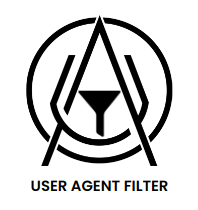

<h1 align="center">Hi 👋, I'm Ambily Biju</h1>
<h3 align="center">Data Science Enthusiast | Python Programmer | Web Scraping Specialist</h3>

  
  
  
  

---

### 👩‍💻 About Me
Data Science Intern with expertise in data analysis, web scraping, and Python programming. Proficient in designing efficient data pipelines and data preprocessing using tools like pandas and scikit-learn. Strong analytical skills and passionate about solving complex problems with data-driven solutions.

---

<h3>🛠️ Technical Skills</h3>

  <!-- Programming Language -->
  
  
  <!-- Machine Learning -->
  
  
  <!-- Deep Learning -->
  
  

  <!-- Web Scraping -->
  
  
  
  
  <!-- Data Manipulation -->
  
  

  <!-- Data Visualization -->
  
  
  
  
  <!-- Database Management -->
  
  

  <!-- Development Tools -->
  
  
  

  <!-- Version Control -->
  

---

### 💼 Work Experience
**Data Science Intern** - *Datahut*  
*May 2024 - Present*  
- Leveraged Python libraries such as Playwright, Selenium, Scrapy, Beautiful Soup, and Requests to optimize web scraping processes and enhance efficiency.
- Transformed unstructured data into clean, structured formats using OpenRefine and Python, ensuring data integrity.
- Conducted exploratory data analysis (EDA) to uncover patterns, trends, and actionable insights for data-driven decision-making.

---

### 🚀 Projects

####  [UserAgentFilter](https://github.com/ambilynanjilath/UserAgentFilter) | [pip](https://pypi.org/project/UserAgentFilter/)
- Developed a Python package to efficiently test user agents across websites with error handling, proxy support, and detailed logging.
- Enhanced web scraping reliability by automating user agent management.

####  [FeatureRefiner](https://github.com/ambilynanjilath/FeatureRefiner) | [pip](https://pypi.org/project/FeatureRefiner/)
- Created FeatureRefiner, a comprehensive data preprocessing library that includes scaling, imputation, encoding, and feature engineering.
- Designed with a user-friendly interface for easy DataFrame manipulation, suitable for both technical and non-technical users.

---

### 🎓 Education
**B.Sc Mathematics**  
*Kannur University*  
Graduated with 76%

---

### 📜 Certifications
**Diploma in Big Data Analytics and Data Science**  
*Luminar Technolab, Kochi, Kerala, India*  
*January 2023 - December 2023*  
- Mastered data cleaning, analysis, and modeling.
- Gained hands-on experience in machine learning algorithms for classification, regression, and clustering.
- Learned deep learning techniques for image recognition and NLP.
- Applied computer vision for image processing and object detection.
- Developed proficiency in data visualization using Power BI.
- Skilled in data preprocessing and large dataset handling with Hadoop and Spark.

---

### 🌐 Languages
- English
- Malayalam

---

Feel free to reach out or explore my projects and contributions!
